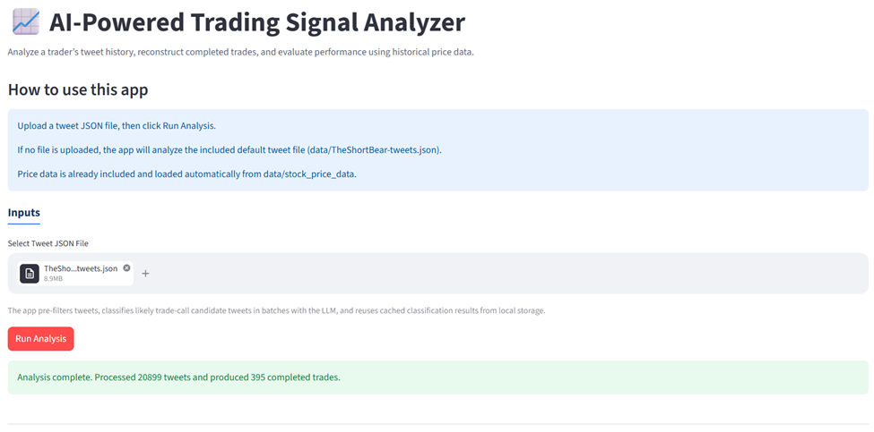
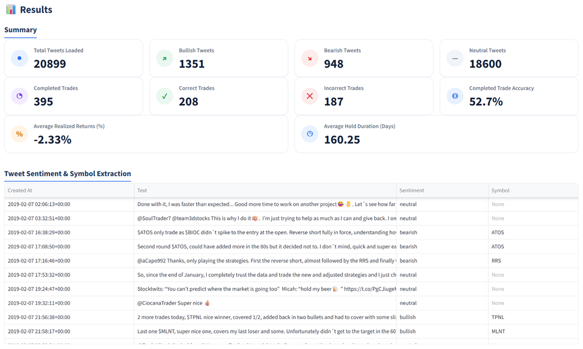
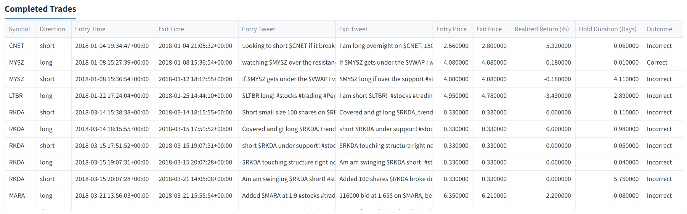

# 📈 AI-Powered Trading Signal Analyzer

## Overview

This application processes a tweet history and reconstructs completed trades based on bullish and bearish signals. It then evaluates those trades using historical price data to compute accuracy and performance metrics.

The system uses a hybrid approach combining deterministic rules with LLM-based classification to efficiently handle large datasets while preserving accuracy.





---

## Setup

### Prerequisites

- Python 3.11+ installed
- OpenAI API key created

### 1. Open the project folder

Unzip the submitted project folder, then open a terminal in the project root (the folder containing `main.py` and `requirements.txt`).

**Option A: Using File Explorer/Finder**

- Navigate to the project folder
- Right-click inside the folder → "Open in Terminal"

**Option B: Using the command line**

```bash
cd <path/to/Hannah-Moskios-Design-Challenge>
```

### 2. Create and activate a virtual environment

#### Windows PowerShell

```bash
py -3 -m venv .venv
.\.venv\Scripts\Activate.ps1
```

#### Mac/Linux

```bash
python3 -m venv .venv
source .venv/bin/activate
```

### 3. Install dependencies

```bash
python -m pip install --upgrade pip
pip install -r requirements.txt
```

### 4. Add the price data

Due to the 10 MB upload limit, the full price dataset is not included in this zip.

- Download the price data from: https://drive.google.com/file/d/1PCO4OFTWhxi7_7q3O1yowQlQ2vPecVA0/view?usp=sharing

- Unzip the downloaded file.

- Place the `stock_price_data` folder inside the `data/` directory in the project. Your folder structure should look exactly like this:

```
project_root/
├── data/
│   └── stock_price_data/
│       ├── AAPL.csv
│       ├── TSLA.csv
│       └── ...
├── src/
├── main.py
└── ...
```

⚠️ Important:
- Do **not** place the CSV files directly inside `data/`
- The folder must be named exactly `stock_price_data`
- The app expects the path: `data/stock_price_data/`

If this structure is incorrect, the app will not be able to load price data.

### 5. Add your OpenAI API key

First, make a copy of `.env.template`:

#### Windows PowerShell

```bash
copy .env.template .env
```

#### Mac/Linux

```bash
cp .env.template .env
```

Then open `.env` and fill in your **OpenAI API key**. If no API key is provided, the app will still run using rule-based classification, but ambiguous tweets will default to neutral and overall accuracy may be lower.

### 6. Run the application

```bash
streamlit run main.py
```

After running, Streamlit will start a local server and automatically open the app in your browser.

---

## Tech Stack

- Python
- Streamlit
- OpenAI API (LLM classification)
- Pandas (data processing)

---

## Architecture

```
design-challenge/
├── data/
│   ├── TheShortBear-tweets.json   # Default tweet dataset
│   └── stock_price_data/          # OHLCV CSV files per symbol
├── src/
│   └── app/
│   ├── classify.py                # LLM + rule-based tweet classification
│   ├── loaders.py                 # Tweet and price data loading
│   ├── models.py                  # Data models (TweetRecord, TradeRecord)
│   ├── pipeline.py                # End-to-end pipeline orchestration
│   ├── reconstruct.py             # Deterministic trade reconstruction
│   ├── score.py                   # Trade scoring and summary metrics
│   └── ui.py                      # Streamlit UI
├── tests/                         # Pytest unit and integration tests
├── main.py                        # App entry point
├── requirements.txt
├── .env.template
└── README.md
```

---

## Features

- 📂 Upload a tweet JSON file (or use the default dataset)
- 🤖 Classify tweets as bullish, bearish, or neutral
- 🔍 Extract trade symbols from actionable tweets
- 🔁 Reconstruct round-trip trades per symbol
- 📊 Compute trade accuracy and performance metrics
- ⚡ Fast execution with caching and optimized processing
- 🖥️ Clean Streamlit UI for ease of use

---

## How It Works

### 1. Data Loading
- Tweets are loaded from JSON and normalized
- Price data is loaded from local CSV files (`data/stock_price_data`)

### 2. Tweet Classification
Each tweet is classified as **bullish**, **bearish**, or **neutral**. In practice, not all tweets are actionable trade signals. A filtering step is used to identify likely trade-call candidates (e.g., containing directional language or ticker-like patterns). Only these candidates are sent to the LLM, while clearly non-actionable tweets are classified as neutral using deterministic rules. This results in a hybrid approach:

- Deterministic rules handle obvious cases
- Likely trade-call tweets are sent to an LLM
- All tweets receive a final classification

This avoids sending all ~20k tweets to the LLM, dramatically improving speed and performance.

### 3. Symbol Extraction
- Symbols are extracted for bullish/bearish tweets
- Tweets without symbols are excluded from trade reconstruction

### 4. Trade Reconstruction

Trades are reconstructed per symbol using deterministic rules:

- bullish → bearish = long trade
- bearish → bullish = short trade
- opposite sentiment closes the trade
- closing tweet opens the next trade
- repeated same-direction signals are ignored
- unfinished trades are excluded

### 5. Trade Scoring

Using daily OHLCV price data:
- Entry price = open price on entry date
- Exit price = close price on exit date

A trade is **correct** if price moves in the expected direction, and **incorrect** otherwise.

Metrics:
- Completed trades
- Accuracy
- Average realized return (%)
- Average hold duration (days)

---

## Performance
The following optimizations allow the app to process large datasets (~20k tweets) while maintaining responsiveness:

- Hybrid LLM usage (only classify likely trade tweets)
- Persistent caching of classifications
- Load only required price data
- Batch + concurrent LLM calls

---

## Assumptions

**Daily price data granularity**

- Only daily OHLCV data is provided, so:
    - Entry price = open price on or after entry date
    - Exit price = close price on or after exit date

**Symbol requirement**

- Trade reconstruction requires a symbol
- Tweets without a clear symbol are excluded from trade reconstruction

**Clear trade intent**

- Only tweets expressing a clear bullish or bearish trade call are used
- Ambiguous or non-actionable tweets are classified as neutral

**One symbol per trade**

- Each tweet is assumed to refer to a single primary symbol for reconstruction

**No transaction costs or slippage**

- Returns are calculated purely from price movement
- Execution costs (e.g., commissions, spreads, slippage) are not modeled

---

## Limitations

- **Daily price data**: intraday price movements are not captured
- **Entry/exit prices**: these prices are approximations
- **Symbol extraction**: heuristic-based and may miss or misidentify symbols in edge cases
- **LLM variability**: classification of ambiguous tweets depends on model behavior